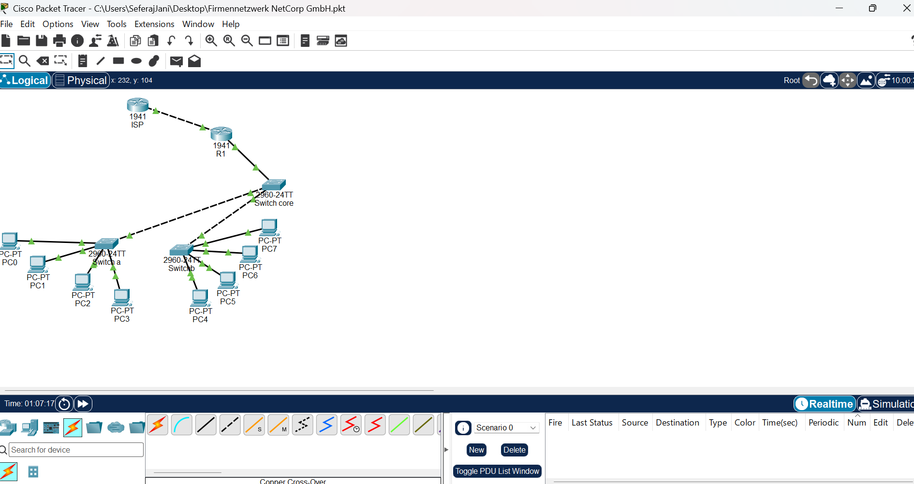

# NetCorp GmbH – Enterprise Network Design (CCNA Practice Project)

A simulated multi-department enterprise network built in Cisco Packet Tracer, demonstrating VLAN segmentation, trunking, inter-VLAN routing, and internet edge connectivity — built as part of CCNA 200-301 exam preparation.

## 📋 Project Overview

This project simulates a company ("NetCorp GmbH") with four departments, each isolated into its own VLAN, routed through a central router, with a simulated internet uplink. The design follows a Two-Tier (Collapsed Core) architecture: an Access Layer of departmental switches, a Core Switch aggregation point, and an Edge Router handling both inter-VLAN routing and internet connectivity.

## 🗺️ Topology



```
[ISP] ── (203.0.113.0/30) ── [R1]
                                │ Gi0/0 TRUNK
                            [SW-CORE]
                            /        \
                       TRUNK          TRUNK
                        /                \
                    [SW-A]              [SW-B]
                   /      \            /      \
              Access    Access    Access    Access
              PC1,2      PC3,4     PC5,6     PC7,8
             (VLAN10)  (VLAN20)  (VLAN30)  (VLAN40)
```

## 🏢 Department / VLAN Design

| Department | VLAN ID | Subnet | Gateway |
|---|---|---|---|
| Sales | 10 | 192.168.10.0/24 | 192.168.10.1 |
| IT | 20 | 192.168.20.0/24 | 192.168.20.1 |
| HR | 30 | 192.168.30.0/24 | 192.168.30.1 |
| Accounting | 40 | 192.168.40.0/24 | 192.168.40.1 |

## 🔧 Technologies Demonstrated

- **VLAN segmentation** — logical separation of departmental traffic into independent broadcast domains
- **802.1Q trunking** — carrying multiple VLANs across single physical links between switches, with a hardened Native VLAN (moved off VLAN 1) and DTP negotiation disabled (`switchport nonegotiate`) to reduce VLAN hopping exposure
- **Router-on-a-Stick inter-VLAN routing** — a single router interface subdivided into per-VLAN subinterfaces (802.1Q encapsulation) to route between departments
- **Static default routing** — simulated internet edge connectivity via a static default route to an upstream ISP router
- **Structured Layer 2/3 design** — Access → Distribution/Core → Edge, following a Two-Tier (Collapsed Core) architecture

## 📁 Repository Structure

```
netcorp-firmennetzwerk/
├── README.md                  # This file
├── topology-screenshot.png    # Full network diagram
└── configs/
    ├── sw-a-config.txt        # Access switch: Sales + IT
    ├── sw-b-config.txt        # Access switch: HR + Accounting
    ├── sw-core-config.txt     # Core switch (trunk aggregation)
    ├── r1-config.txt          # Edge router (inter-VLAN + WAN)
    └── isp-config.txt         # Simulated ISP router
```

## ✅ Verified Connectivity

| Test | Path | Result |
|---|---|---|
| Intra-VLAN | PC1 → PC2 (Sales) | ✅ Success |
| Inter-VLAN | PC1 → PC3 (Sales → IT) | ✅ Success |
| Inter-VLAN | PC1 → PC5 (Sales → HR) | ✅ Success |
| Inter-VLAN | PC3 → PC7 (IT → Accounting) | ✅ Success |
| Internet simulation | PC1 → 8.8.8.8 | ✅ Success |
| WAN link | R1 → ISP (203.0.113.1) | ✅ Success |

## 🐛 Troubleshooting Case Study

**Symptom:** `ping 8.8.8.8` from PC1 failed with "Destination host unreachable" reported by R1. A direct `ping 203.0.113.1` from R1 also failed at 0% success.

**Diagnosis:**
1. `show ip interface brief` on R1 showed `GigabitEthernet0/1: Status=up, Protocol=down` — indicating the interface was administratively enabled and correctly addressed, but the link itself wasn't establishing.
2. `show ip interface brief` on the ISP router showed the configured interface (Gi0/1) as `down/down`, while the *unconfigured* interface (Gi0/0) was `administratively down` — a strong hint the physical cable was on the wrong port.
3. Switching to the Physical view in Packet Tracer confirmed the cable was physically connected to Gi0/0 on the ISP router, not Gi0/1 as the configuration assumed.

**Resolution:** Relocated the cable to the correct interface (Gi0/1), matching the existing IP configuration.

**Key takeaway:** A `Status=up / Protocol=down` combination almost always points to a **Layer 1 physical issue** (wrong port, bad cable, or a down remote end) rather than a Layer 3 addressing problem — worth checking the Physical topology view before re-auditing IP configuration.

## 🎓 Context

Built as a hands-on practice project while studying for the CCNA 200-301 certification (Network Access domain: VLANs, trunking, inter-VLAN routing), as part of a FISI (Fachinformatiker Systemintegration) apprenticeship.
