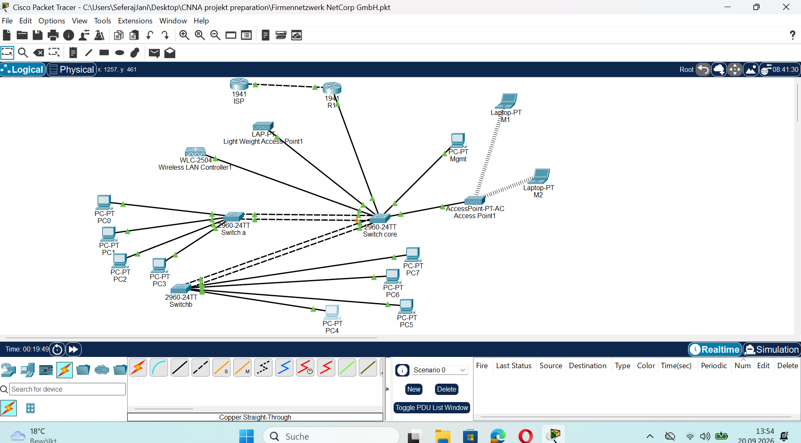

# NetCorp GmbH – Capstone Extension (Module 2 Complete)

Extension of the original NetCorp network project adding EtherChannel link aggregation, deliberate STP root bridge selection, a Wireless LAN Controller (WLC) with CAPWAP, and a 5th department (Marketing) with wireless access.

## Topology



## What's New

| Area | Before | Now |
|---|---|---|
| SW-A ↔ SW-CORE | Single trunk link | EtherChannel (Po1, LACP active) |
| SW-B ↔ SW-CORE | Single trunk link | EtherChannel (Po2, LACP active) |
| Root Bridge | Random (MAC-based) | Deliberately set to SW-CORE (priority 4096) |
| Departments | 4 (wired) | + Marketing (VLAN 50, wireless) |
| New devices | – | WLC-2504, Lightweight AP, Autonomous AP, 2 laptops |

## New VLAN Design

| Department | VLAN ID | Subnet | Gateway |
|---|---|---|---|
| Marketing (Wireless) | 50 | 192.168.50.0/24 | 192.168.50.1 |
| Wireless Management | 100 | 192.168.1.0/28 | 192.168.1.1 |

---

## Configuration Highlights

### EtherChannel (SW-A/SW-B ↔ SW-CORE)

```
interface range gigabitEthernet 0/1-2
 speed 100
 duplex full
 switchport trunk encapsulation dot1q
 switchport trunk native vlan 999
 switchport mode trunk
 switchport nonegotiate
 channel-group 1 mode active
exit
interface port-channel 1
 switchport trunk native vlan 999
 switchport mode trunk
```

### STP Root Bridge (SW-CORE)

```
spanning-tree vlan 10,20,30,40,999 priority 4096
```

### DHCP for Wireless Management VLAN (R1)

```
interface gigabitEthernet 0/0.100
 encapsulation dot1q 100
 ip address 192.168.1.1 255.255.255.240
exit
ip dhcp excluded-address 192.168.1.1 192.168.1.3
ip dhcp pool VLAN100-POOL
 network 192.168.1.0 255.255.255.240
 default-router 192.168.1.1
```

### Marketing Subinterface (R1)

```
interface gigabitEthernet 0/0.50
 encapsulation dot1q 50
 ip address 192.168.50.1 255.255.255.0
```

---

## Verified Test Results

| Test | Result |
|---|---|
| `show etherchannel summary` (both bundles) | ✅ Both Po1/Po2 show "P" (bundled) |
| `show spanning-tree vlan 10` | ✅ SW-CORE reports "This bridge is the root" |
| Lightweight AP → WLC registration | ✅ Successful after DHCP fix |
| Marketing laptop → Marketing laptop (WLAN) | ✅ Successful (via Autonomous AP) |
| Marketing → other departments / Internet | ✅ Successful |

---

## Troubleshooting Case Studies (5 Real Issues Resolved)

### Case 1: EtherChannel Duplex Mismatch
**Symptom:** `%EC-5-CANNOT_BUNDLE2: Gig0/1 is not compatible with Gig0/2 ... duplex of Gig0/1 is half, Gig0/2 is full`

**Root cause:** Auto-negotiation resulted in different duplex settings on each interface.

**Fix:** Explicitly set `duplex full` and `speed` on both interfaces simultaneously using `interface range`.

**Takeaway:** EtherChannel requires identical settings across all member ports — never rely on auto-negotiation for bundle members.

### Case 2: Hardware Port Limitation (No Free Gigabit Ports)
**Symptom:** SW-CORE had no free GigabitEthernet ports left for the second EtherChannel connection.

**Root cause:** 2960 switches only have 2 Gigabit ports, both already used for the SW-A connection.

**Fix:** Used FastEthernet ports on the SW-CORE side instead, explicitly setting `speed 100` on both ends (a Gigabit port can negotiate down to 100 Mbps).

**Takeaway:** Port type names don't need to match on both ends of a cable — only speed and duplex need to match.

### Case 3: Native VLAN Mismatch After Reconfiguration
**Symptom:** `%CDP-4-NATIVE_VLAN_MISMATCH` between SW-B and SW-CORE despite seemingly correct configuration.

**Root cause:** The native VLAN setting had only been applied to one of the two member interfaces, not both.

**Fix:** Performed a clean reset — `shutdown` → `no channel-group` → reapplied all settings explicitly with `interface range` → `no shutdown`.

**Takeaway:** For persistent EtherChannel errors, a clean reset (shut down, remove channel-group, reconfigure from scratch) is more reliable than patching individual settings.

### Case 4: Lightweight AP Fails to Register with WLC (0 APs)
**Symptom:** All switch interfaces up/up, AP configuration correct, yet the WLC reported "Number of APs: 0".

**Root cause:** Lightweight APs have no manual IP address field — they rely entirely on DHCP for their management IP. No DHCP server existed on the wireless management VLAN.

**Fix:** Configured a DHCP pool on R1 for the 192.168.1.0/28 subnet.

**Takeaway:** For devices without a manual IP field (Lightweight APs, many IoT devices), verify a DHCP server exists on the relevant VLAN before troubleshooting further.

### Case 5: Wireless Client Won't Connect (Frequency Band Mismatch)
**Symptom:** The laptop's wireless adapter persistently showed "Adapter is Inactive," with no networks visible in scans.

**Root cause 1:** The Autonomous AP was initially configured on "Port 1," which turned out to be a 5 GHz radio — the laptop's adapter (WPC300N) only supports 2.4 GHz.

**Root cause 2:** A different AP model had no 2.4 GHz radio at all (its "Port 0" was only the wired Ethernet port).

**Fix:** Switched to an AP model with a compatible 2.4 GHz radio and configured SSID/security correctly on it.

**Takeaway:** Frequency band compatibility between AP and client adapter is a baseline requirement that should be checked before troubleshooting security or SSID settings.

## Documented Simulator Limitation

Full wireless client connectivity through a **Lightweight AP + WLC** (split-MAC architecture) could not be established in Cisco Packet Tracer, despite successful CAPWAP registration of the AP — several WLC configuration pages (e.g., enabling the 802.11b/g/n network) explicitly display "This feature is not supported in Packet Tracer." This is a known, documented limitation of the simulator, not a misconfiguration. An additional Autonomous AP, whose client connectivity is fully simulated, was used for the working end-to-end wireless test.

## Context

Built as a hands-on capstone project while studying for the CCNA 200-301 certification (Network Access domain: VLANs, trunking, inter-VLAN routing, STP, EtherChannel, WLC), as part of a FISI (Fachinformatiker Systemintegration) apprenticeship in Germany.
